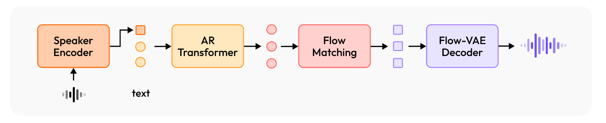

# Open-Minimax-Speech(WIP)
Unofficial Implementation of [MiniMax-Speech](https://arxiv.org/abs/2505.07916)

|SubModule|Details|
|---------|---------|
|VQ-VAE|DVAE from [Tortoise](https://github.com/neonbjb/DL-Art-School/blob/master/codes/models/audio/tts/lucidrains_dvae.py)|
|LLM|GPT-2 from [XTTS](https://github.com/coqui-ai/TTS/blob/dev/TTS/tts/layers/xtts/gpt.py)|
|Flow Matching|Conditional Flow Matching from [CosyVoice](https://github.com/FunAudioLLM/CosyVoice/blob/main/cosyvoice/flow/flow_matching.py)|
|Flow-VAE|Encoder(Conv), Decoder(Conv, MRF) and Discriminator(MPD, MSD, MRD) are from [DAC](https://github.com/descriptinc/descript-audio-codec/blob/main/dac/model/dac.py) <br> Flow(RealNVP) from [VITS](https://github.com/heatz123/naturalspeech/blob/main/models/models.py#L577)|
## 📣 Updates

## Key Features

## Installation

## Usage
### Data Preparation
### Training
#### Step1. VQ-VAE
To train from scratch on LibriTTS dataset, you can run the following command:
```
python minimaxspeech/trainers/vq_vae_trainer.py \
    --config configs/vq_vae_config_libritts.yaml

# Multi-GPU with DDP
export CUDA_VISIBLE_DEVICES='0,1,2,3,4,5,6,7'
torchrun --nproc_per_node=8  minimaxspeech/trainers/vq_vae_trainer.py \
      --config configs/vq_vae_config_libritts.yaml
```
You can also finetune a pretrained model by runing:
```
# Download Pretrained Models
wget -O ./checkpoints/vq_vae/dvae.pth https://coqui.gateway.scarf.sh/hf-coqui/XTTS-v2/main/dvae.pth
wget -O ./checkpoints/vq_vae/mel_stats.pth https://coqui.gateway.scarf.sh/hf-coqui/XTTS-v2/main/mel_stats.pth

python minimaxspeech/trainers/vq_vae_trainer.py \
    --config configs/vq_vae_config_libritts_ft.yaml
```
#### Step2. GPT2

#### Step3. Flow-VAE

##### Train
```
# Single GPU
python minimaxspeech/trainers/flow_vae_trainer.py \
    --config configs/flow_vae_config.yaml

# Multi-GPU with DDP
export CUDA_VISIBLE_DEVICES='0,1,2,3,4,5,6,7'
torchrun --nproc_per_node=8 minimaxspeech/trainers/flow_vae_trainer.py \
    --config configs/flow_vae_config.yaml
```

##### Finetune
If you want to finetune the flow-vae by utilizing the official encoder and decoder weights of DAC, please download the [official weights](https://github.com/descriptinc/audiotools?tab=readme-ov-file) and move them to the `checkpoints/dac` from the `~/.cache/descript/dac/`. Then you can run the following command:
```
python minimaxspeech/trainers/flow_vae_trainer.py \
    --config configs/flow_vae_config_ft.yaml
```
##### Evaluation
The following command can be run to evaluate the reconstruction quality of Flow-VAE and obtain reconstructed audio:
```
python minimaxspeech/utils/audio_utils/flow_vae_audio_reconstruct.py \
    --config configs/flow_vae_config.yaml \
    --ckpt_file output/flow_vae/checkpoint_090000.pth \
    --input data/dac/evaluate/valid \
    --output data/dac/evaluate/valid_recon_flow_vae
```
Then compute the following audio quality metrics: PESQ, STOI, ViSQOL and Mel distance.
```
python minimaxspeech/utils/audio_utils/reconstruction_evaluate.py \
    --input data/dac/evaluate/valid \
    --output data/dac/evaluate/valid_recon_flow_vae
```

### Inference

## ISSUE

## Troubleshooting

## Acknowledgements
- [XTTSv2-Finetuning](https://github.com/anhnh2002/XTTSv2-Finetuning-for-New-Languages)
- [DAC](https://github.com/descriptinc/descript-audio-codec)

## Citation
If you use this work, please cite the original Minimax-Speech paper:

```
@article{zhang2025minimaxspeech,
      title={MiniMax-Speech: Intrinsic Zero-Shot Text-to-Speech with a Learnable Speaker Encoder}, 
      author={Bowen Zhang and Congchao Guo and Geng Yang and Hang Yu and Haozhe Zhang and Heidi Lei and Jialong Mai and Junjie Yan and Kaiyue Yang and Mingqi Yang and Peikai Huang and Ruiyang Jin and Sitan Jiang and Weihua Cheng and Yawei Li and Yichen Xiao and Yiying Zhou and Yongmao Zhang and Yuan Lu and Yucen He},
      year={2025},
      eprint={2505.07916},
      archivePrefix={arXiv},
      primaryClass={eess.AS},
      url={https://arxiv.org/abs/2505.07916}, 
}
```